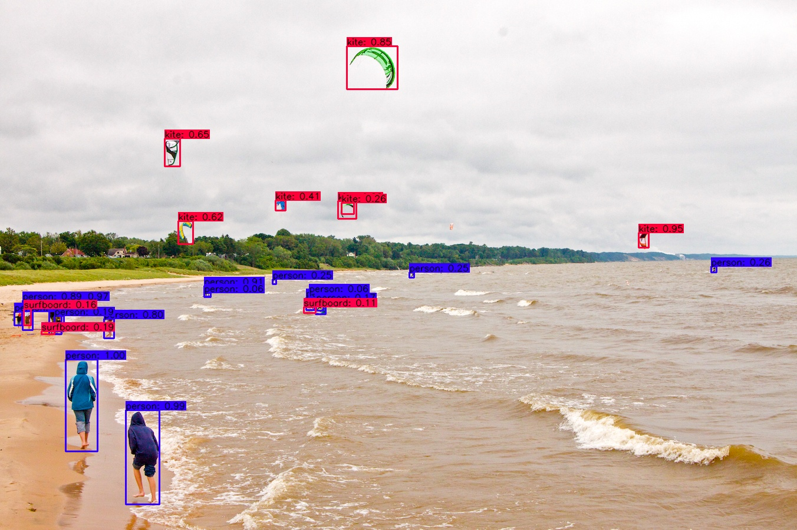
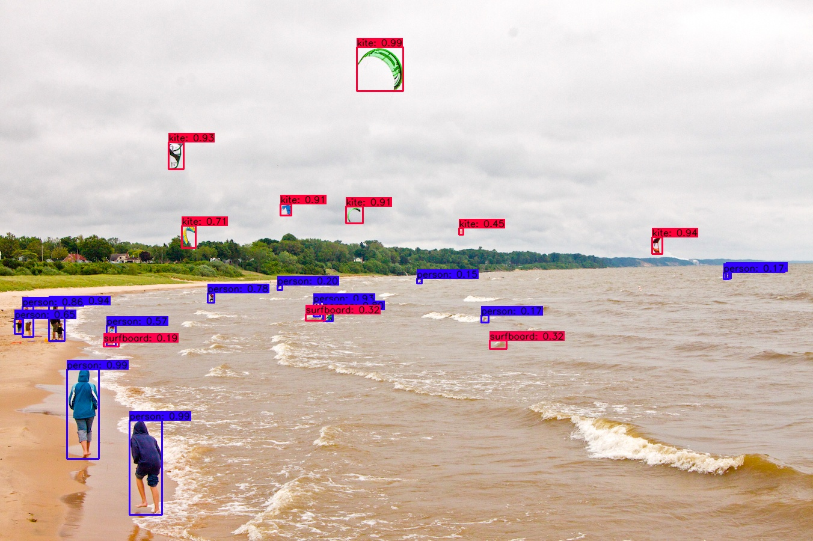

# Darkeras: Execute YOLOv3/YOLOv4 Object Detection on Keras with Darknet Pre-trained Weights

This project is to execute YOLOv3/YOLOv4 object detector on Keras framework with Darknet pre-trained weights.

Medium article: (will be updated)

### Dependencies
- OpenCV
- Tensorflow 2.3.0
- Keras 2.4.0
- Easydict
- Matplotlib

You can simply run:
```bashrc
$ pip install -r requirements.txt
```

### Supported Models
- YOLOv3
- YOLOv4

### How to Use

#### 1. Run with Notebook
- Put pre-trained weights from official Darknet [website](https://pjreddie.com/darknet/yolo/) or your trained weights into "weights" folder (If you use your model trained on your customed dataset, please change NUM_CLASS and ANCHORS in the notebooks)
- Run YOLOv3: darkeras-yolov3.ipynb
- Run YOLOv4: darkeras-yolov4.ipynb

#### 2. Run with Python Scripts
- Convert Darknet (format: weight_file.weights) to Keras (format: weight_file.h5): to be updated
- Run YOLOv3: to be updated
```bashrc
$ python detect_yolov3.py
```
- Run YOLOv4: to be updated
```bashrc
$ python detect_yolov4.py
```

### Detection Result
- Input


- YOLOv3


- YOLOv4



Have fun!

LA Tran

Korea, August 2021
